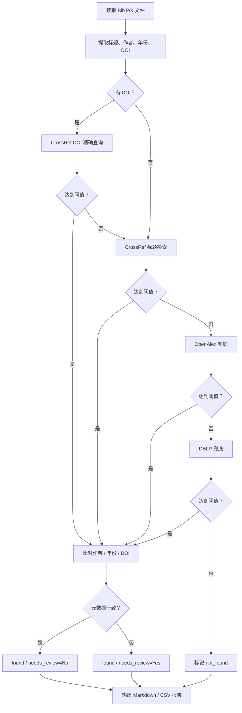

# RefChecker：BibTeX 文献真实性与元数据一致性批量核验工具

> 基于 CrossRef、OpenAlex 与 DBLP 的 BibTeX 参考文献核验脚本，从 **DOI、标题、作者、年份** 四个维度交叉验证每条引用，批量生成 Markdown / CSV 报告。

RefChecker 适合在论文写作、毕业设计、综述整理或参考文献清洗阶段使用。它会读取 BibTeX 文件中的文献条目：

- 如果条目有 DOI，优先通过 CrossRef 进行 DOI 精确查询；
- 否则基于标题在 CrossRef 中检索，未命中时依次使用 OpenAlex（覆盖预印本 / 会议 / 技术报告）和 DBLP（计算机科学领域）兜底；
- 对每条匹配结果还会额外比对 **作者列表、发表年份、DOI**，发现作者省略、顺序错乱、多余作者、年份不一致、DOI 冲突等问题。

最终每条文献会被标记为 `found` / `not_found` / `skipped`，同时附带 `needs_review` 标志，方便你一眼看出哪些条目即便"找到"也需要人工确认。

> 注意：本项目是"辅助核验"工具，不能单独作为判断文献真实性的唯一依据。未匹配不一定代表文献不存在，匹配成功也建议结合 DOI、作者、年份和期刊/会议进一步确认。

## 功能特点

- **多源交叉验证**：CrossRef + OpenAlex + DBLP，可按需关闭兜底源
- **DOI 优先查询**：有 DOI 的条目直接用 CrossRef DOI 接口精确匹配
- **标题相似度匹配**：LaTeX 去标记、去重音、标点归一化后使用 `SequenceMatcher` 计算相似度
- **作者一致性检查**：
  - 支持 `Last, First` 与 `First Last` 两种 BibTeX 作者格式
  - 处理姓氏粒子（van, de, von, della …）与后缀（Jr, Sr, II …）
  - 识别 `others` / `et al.` 省略标记
  - 区分"顺序异常"、"遗漏作者"、"多余作者"、"首作者不一致"等场景
- **年份与 DOI 一致性检查**：对比 BibTeX 中的年份 / DOI 与数据库返回值
- **评分与候选排序**：按标题相似度 + 作者 + 年份综合打分，选取最佳候选
- **灵活的命令行参数**：可配置相似度阈值、请求间隔、邮箱 User-Agent、是否启用各兜底源
- **多种输出形式**：
  - 命令行实时进度与汇总
  - Markdown 报告（含需复核条目、元数据不一致清单、完整结果表）
  - CSV 表格（30+ 字段，便于用 Excel / pandas 进一步分析）

## 项目结构

```text
.
├── check_bib_crossref.py          # 主程序：解析 BibTeX 并调用 CrossRef / OpenAlex / DBLP 核验
└── README.md
```

## 环境要求

- Python 3.8+
- Python 依赖：
  - `bibtexparser`
  - `requests`

安装依赖：

```bash
pip install bibtexparser requests
```

也可以先创建虚拟环境：

```bash
# Windows PowerShell
python -m venv .venv
.\.venv\Scripts\Activate.ps1
pip install bibtexparser requests
```

```bash
# macOS / Linux
python3 -m venv .venv
source .venv/bin/activate
pip install bibtexparser requests
```

## 快速开始

核验一个 BibTeX 文件：

```bash
python check_bib_crossref.py ref.bib
```

生成 Markdown 报告：

```bash
python check_bib_crossref.py ref.bib --output ref_verification_report.md
```

同时生成 Markdown 与 CSV：

```bash
python check_bib_crossref.py ref.bib \
  --output ref_verification_report.md \
  --csv ref_verification.csv
```

建议填写邮箱，以便 CrossRef / OpenAlex 识别为友好访问来源：

```bash
python check_bib_crossref.py ref.bib \
  --email your-email@example.com \
  --output ref_verification_report.md \
  --csv ref_verification.csv
```

仅使用 CrossRef（关闭所有兜底源）：

```bash
python check_bib_crossref.py ref.bib --no-openalex --no-dblp
```

## 命令行参数

| 参数              | 说明                                            | 默认值    |
| --------------- | --------------------------------------------- | ------ |
| `bibfile`       | 待核验的 `.bib` 文件路径                              | 必填     |
| `--threshold`   | 标题相似度阈值，范围为 `0-1`。值越高越严格                      | `0.85` |
| `--delay`       | 每条文献核查后的间隔秒数                                 | `0.2`  |
| `--email`       | 邮箱地址，用于 CrossRef User-Agent / OpenAlex mailto | 空      |
| `--no-openalex` | 不使用 OpenAlex 兜底                              | 关闭     |
| `--no-dblp`     | 不使用 DBLP 兜底                                  | 关闭     |
| `--output`      | Markdown 报告输出路径                               | 不输出    |
| `--csv`         | CSV 表格输出路径                                    | 不输出    |

示例：提高匹配严格度到 90%：

```bash
python check_bib_crossref.py ref.bib --threshold 0.90
```

示例：大批量核验时拉长请求间隔：

```bash
python check_bib_crossref.py ref.bib --delay 1.0
```

## 核查维度

RefChecker 每条文献会从四个维度输出核查结果：

| 维度     | 说明                                                                 |
| ------ | ------------------------------------------------------------------ |
| **DOI**    | 若 BibTeX 中有 DOI，会优先用 CrossRef DOI 接口查询；同时比对匹配结果 DOI 是否一致 |
| **标题**   | 去除 LaTeX 标记 / 重音 / 标点后计算相似度，按阈值判断是否匹配                |
| **作者**   | 对比作者姓氏、名缩写、顺序、数量；识别 `others` / `et al.`；区分省略与不一致 |
| **年份**   | 从 BibTeX 与数据库年份中抽取 4 位年份进行比对                             |

## 输出说明

### 状态分类

每条 BibTeX 记录归为以下状态之一：

| 状态          | 含义                                               |
| ----------- | ------------------------------------------------ |
| `found`     | 在 CrossRef / OpenAlex / DBLP 中找到相似度达到阈值的匹配结果 |
| `not_found` | 所有数据源均未找到达到阈值的结果，需要人工核查                  |
| `skipped`   | 条目缺少标题等必要字段，被跳过                             |

此外每条结果会带 `needs_review` (Yes/No) 与 `review_reasons` 字段，即便状态为 `found`，若存在标题相似度 <100%、作者不一致、年份不一致、DOI 冲突等情况也会被标记为"需复核"。

### Markdown 报告

Markdown 报告会重点列出：

- 未找到匹配的文献
- 需要人工复核的条目（含具体原因）
- 作者 / 年份 / DOI 元数据不一致的条目
- 所有条目的完整结果表

### CSV 字段

CSV 输出包含 30+ 字段，便于二次分析：

```text
key, status, needs_review, review_reasons, perfect_match,
bib_title, matched_title, similarity, source, venue, year, type,
authors, doi, url, reason,
author_check, author_reason, bib_authors, matched_authors,
matched_author_count, bib_author_count, missing_authors, extra_authors,
author_order_mismatch, first_author_match,
year_check, year_reason, bib_year, matched_year,
doi_check, doi_reason, bib_doi, matched_doi
```

### 命令行状态图标

| 图标 | 含义                           |
| -- | ---------------------------- |
| ✅  | 完美匹配（标题 100% 且元数据一致）       |
| 🟡 | 找到但需复核（相似度低 / 元数据有差异）     |
| ❌  | 未找到 / 元数据冲突                  |
| ⚪  | 元数据缺失，无法核查                   |
| ⚠️  | 跳过（如缺少 title 字段）             |

## 示例结果

以示例文件 `ref.bib`（192 条记录）的一次核验为例，命令行会输出类似：

```text
========================================================================
总结: ✅ 185 找到 | ❌ 7 未找到 | ⚠️ 33 需复核 | 跳过 0
元数据问题: 作者不一致 13 | 年份不一致 21 | DOI 不一致 0
========================================================================
```

"需复核"并不意味着文献有错，常见原因包括：

- 标题拼写 / 副标题差异导致相似度 <100%
- BibTeX 中作者被省略（`others` / `et al.`）
- BibTeX 年份与数据库年份存在一年左右偏差（会议预印本 vs 正式出版）
- 数据库作者顺序或名字写法与 BibTeX 不同
- 文献没有 DOI，或 BibTeX 中的 DOI 与数据库记录不一致

## 工作流程



## 使用建议

1. 首次运行建议使用默认阈值 `0.85`。
2. 如果误匹配较多，可以提高阈值，例如 `--threshold 0.90`。
3. 如果很多真实文献未命中，可以适当降低阈值，例如 `--threshold 0.80`，但要加强人工复核。
4. 文献较多时建议设置更长请求间隔，例如 `--delay 0.5` 或 `--delay 1`，避免被 API 限流。
5. 填写 `--email` 可提高 CrossRef / OpenAlex 的访问稳定性。
6. 优先关注 CSV 中 `needs_review=Yes` 且 `author_check=mismatch` 或 `year_check=mismatch` 的条目。
7. 上传公开仓库前，请确认 `ref.bib` 中是否包含你不希望公开的论文草稿、未发表文献或个人备注。

## 局限性

- 作者核查是"元数据一致性检查"，不能 100% 证明作者真伪；数据库本身也可能缺失或有误。
- CrossRef / OpenAlex / DBLP 的元数据可能存在缺失、延迟或不一致。
- DOI 缺失不代表文献不存在。
- 对非英文标题、特殊 LaTeX 命令、异常编码文本的支持可能有限。
- 同名同姓作者、中文姓名拼写差异等情况下作者比对可能产生误报。
- 本工具无法替代人工学术判断。

## 常见问题

### Windows 终端中文或 emoji 显示乱码怎么办？

可以尝试使用 Windows Terminal / PowerShell 7，或在运行前切换到 UTF-8：

```powershell
chcp 65001
$env:PYTHONUTF8 = "1"
python check_bib_crossref.py ref.bib
```

### 安装 `bibtexparser` 后报 `DelimitedList` 相关错误怎么办？

这是 `bibtexparser` 与旧版 `pyparsing` 命名不一致导致的。本项目在脚本开头做了兼容 patch，一般无需额外处理；如仍有问题可以升级依赖：

```bash
pip install -U bibtexparser pyparsing
```

### 为什么 CrossRef 找不到，但 OpenAlex / DBLP 可以找到？

CrossRef 主要依赖出版商注册的 DOI 元数据。部分会议论文、预印本、技术报告或早期文献可能没有完整 DOI 记录；OpenAlex 覆盖更广，DBLP 则对计算机科学文献尤其有效，因此二者会作为补充数据源。

### 显示"年份不一致"但我确认文献是对的，怎么办？

会议论文常见的情况是：BibTeX 写的是会议举行年份（如 2023），而 CrossRef / DOI 记录的是正式出版年份（如 2024），两者相差一年是正常的。可以根据实际情况选择是否修正 BibTeX。

### `needs_review=Yes` 一定是错误吗？

不一定。`needs_review` 是一个聚合标记，只要标题相似度 <100%、作者有省略 / 顺序差异、年份或 DOI 对不上任何一项都会被标记。它的作用是帮你快速筛选出"值得看一眼"的条目，具体是否需要修改请自行判断。

### 未找到的文献一定是假文献吗？

不一定。`not_found` 只表示没有在当前检索源中找到足够相似的记录。建议手动检查 DOI、Google Scholar、出版社页面、论文官网或图书馆数据库。

## 贡献

欢迎提交 Issue 或 Pull Request，例如：

- 扩展更多数据源（Semantic Scholar、arXiv、PubMed 等）
- 改进中文 / 多语言文献匹配
- 支持增量核验（跳过已核验条目）
- 输出 HTML 可视化报告
- 改进作者姓名的跨语言匹配

## License

尚未指定许可证。开源前建议添加 `LICENSE` 文件，例如 MIT License。
